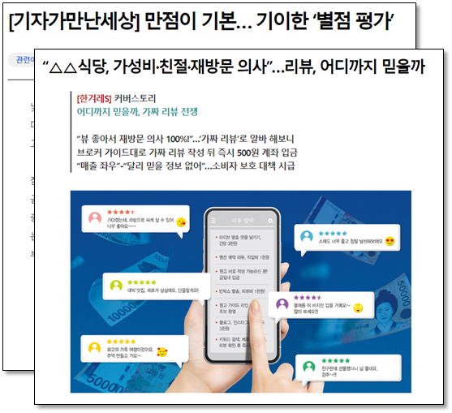
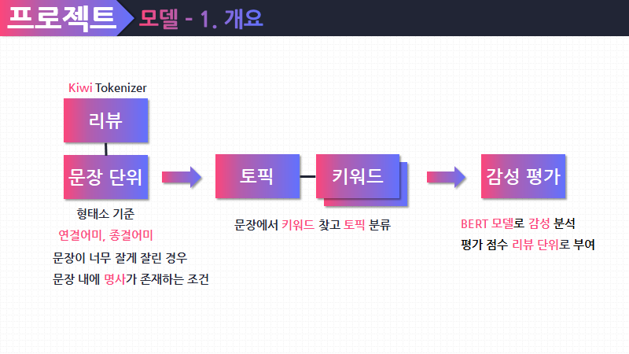
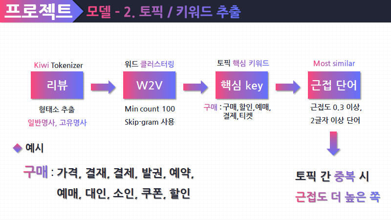
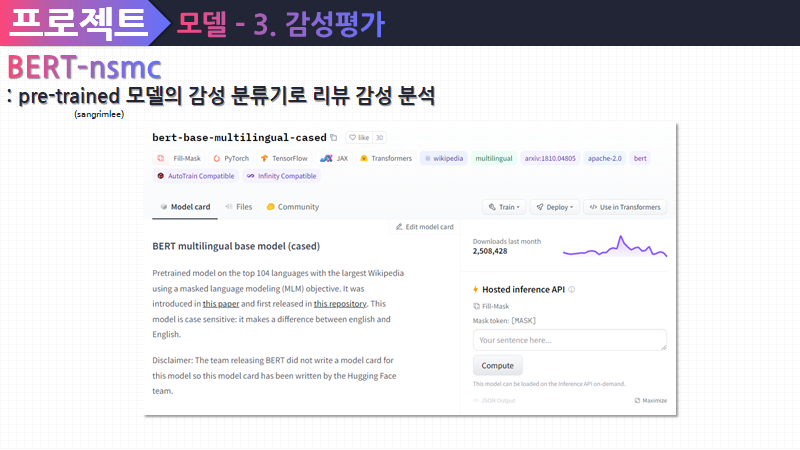
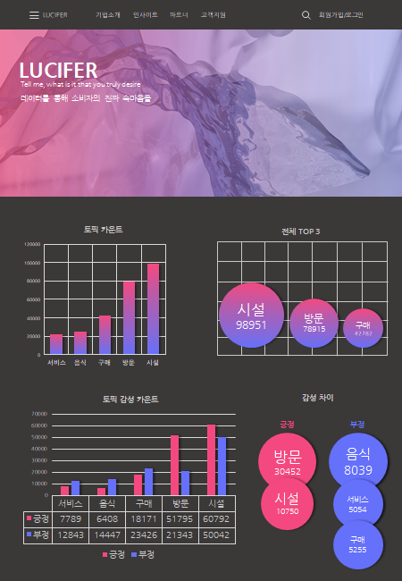
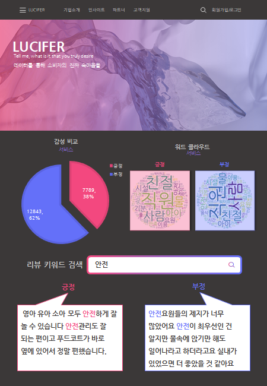
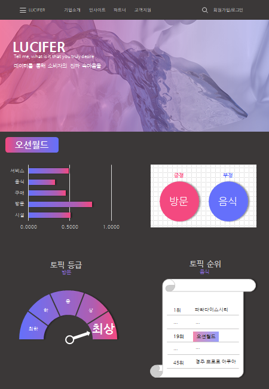

# 워터파크 리뷰 데이터 분석

## 팀원 소개

| 직책     | 이름       |
| -------- | ---------- |
| **팀장** | **강가람** |
| **팀원** | **김영현** |
| **팀원** | **김홍진** |
| **팀원** | **한동권** |

## 문제 인식

1. 기존 리뷰에 대한 **신뢰도 하락**
   - 이벤트, 광고, 조작 등
2. 리뷰를 남기는 소비자마다 **별점 척도에 대한 기준이 다름**
3. **별점이 높은** 리뷰에도 **부정적인 내용 존재**

## 목적 및 기대 효과

1. 소비자 리뷰 분석을 통해 소비자의 **진짜 마음** 읽기
2. 감성 평가에 영향을 미치는 **주요 토픽 및 키워드** 알아내기
3. 위를 통해 **고객관리의 비용 효율성** 높이기

## Workflow

(코드 링크 달아야 함 / 코랩 링크)

### 데이터

1. 크롤링
   1. [NAVER](https://github.com/Younghyeon-Kim/Project/blob/master/%ED%81%AC%EB%A1%A4%EB%A7%81/NAVER_crawling.ipynb)
   2. [Google](https://github.com/Younghyeon-Kim/Project/blob/master/%ED%81%AC%EB%A1%A4%EB%A7%81/google_crawling.ipynb)

2. [전처리](https://github.com/Younghyeon-Kim/Project/blob/master/%EC%A0%84%EC%B2%98%EB%A6%AC.ipynb)
3. 토크나이징

### 모델 구축

1. 개요

2. 토픽 / 키워드 추출

3. 감성 평가

### 모델 실행

1. 토픽 분류
2. 감성 평가

## Result

(결과 내용 다시 추가해야 함)

